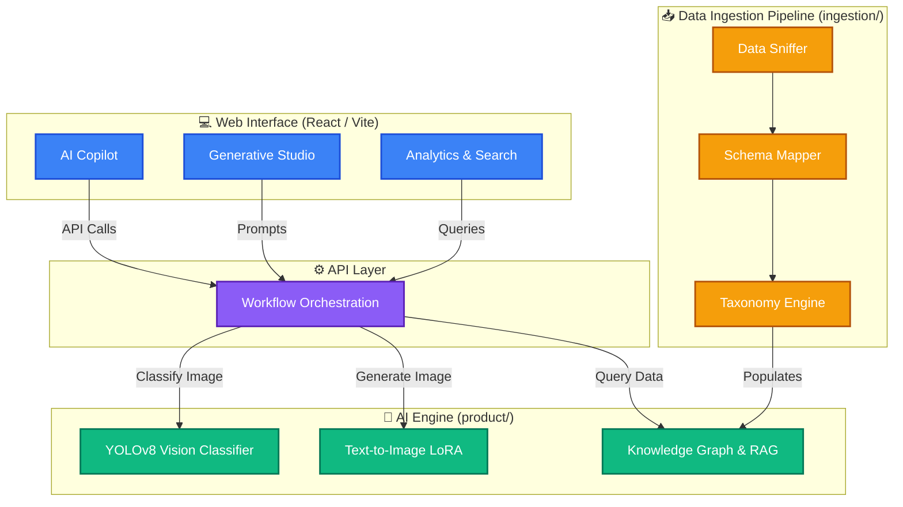

<div align="center">
  
  
  # ORNEXA JEWLS
  
  **AI-Powered Jewelry Ecosystem: Generative Design, Vision Classification, and Intelligent Cataloging**
  
</div>

## 📖 Overview

**ORNEXA JEWLS** is a cutting-edge platform designed to revolutionize the jewelry industry through artificial intelligence. By combining advanced computer vision, generative AI (Text-to-Image with LoRA), and automated catalog ingestion, Ornexa provides a comprehensive suite of tools for jewelry designers, retailers, and catalog managers.

From extracting complex taxonomies from raw unstructured data to generating stunning photorealistic jewelry designs, Ornexa acts as a true AI co-pilot for the modern jeweler.

---

## 🌟 Key Features

- **🎨 Generative Design Studio:** Utilize fine-tuned Text-to-Image LoRA models to brainstorm and generate high-quality jewelry designs from simple text prompts.
- **👁️ AI Vision Classifier:** Automatically classify, tag, and organize jewelry pieces (rings, necklaces, earrings) using a custom-trained YOLOv8 computer vision model.
- **🧠 Knowledge Explorer & Copilot:** Interact with your entire catalog via an intelligent RAG (Retrieval-Augmented Generation) Copilot and Knowledge Graph.
- **⚙️ Automated Ingestion Pipeline:** Robust data mappers, sniffers, and taxonomy engines to seamlessly integrate and standardize messy vendor catalogs.
- **💻 Modern Web Interface:** A sleek, responsive React (Vite) frontend offering modules for Analytics, Orders, Search, and an AI Studio.

---

## 🏗️ System Architecture



---

## 🚀 Getting Started

### 1. Prerequisites
Ensure you have the following installed:
- Node.js (v18+)
- Python 3.10+
- Git LFS (Large File Storage)

### 2. Clone the Repository
Since the repository contains large model weights and datasets, make sure Git LFS is installed before cloning:
```bash
git lfs install
git clone https://github.com/KumarAditya1729/Ornexa_jwels.git
cd Ornexa_jwels
```

### 3. Setup Python Backend (AI Engine & API)
We recommend using a virtual environment:
```bash
python -m venv venv
source venv/bin/activate  # On Windows use `venv\Scripts\activate`
pip install -r requirements.txt
```

### 4. Setup React Frontend
```bash
cd web
npm install
npm run dev
```
The frontend will be available at `http://localhost:5173`.

---

## 📂 Project Structure

```text
ORNEXA JEWLS/
├── api/                  # API endpoints and workflow orchestration
├── benchmarks/           # Evaluation and testing metrics for models
├── data/                 # Local data storage and configuration
├── ingestion/            # Pipeline for sniffing, mapping, and taxonomy extraction
├── model_output/         # Trained checkpoints (e.g., LoRA safetensors)
├── product/              # Core AI modules (Vision, GenAI, Knowledge Explorer)
├── runs/                 # Training logs and outputs from YOLOv8
└── web/                  # React (Vite) frontend web application
```

---

## 🤝 Contributing
Contributions, issues, and feature requests are welcome! Feel free to check the [issues page](https://github.com/KumarAditya1729/Ornexa_jwels/issues).

## 📄 License
This project is licensed under the MIT License.
